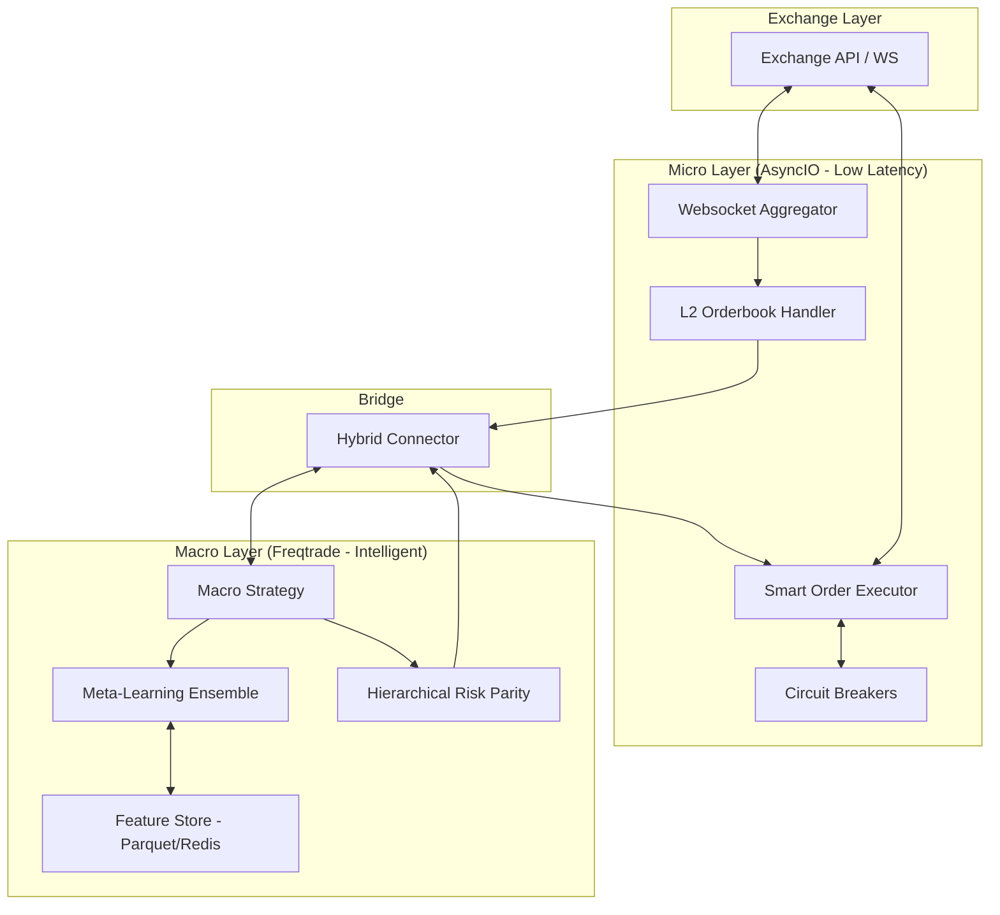

# 🏛️ Stoic Citadel: Hybrid MFT Framework (v2.0)

<div align="center">

[](https://www.python.org/)
[](https://github.com/kandibobe/mft-algotrade-bot/actions)
[](https://opensource.org/licenses/MIT)
[](https://github.com/psf/black)
[](https://www.docker.com/)

**Institutional-grade hybrid trading infrastructure bridging high-conviction macro signals with low-latency execution.**

[Overview](#-overview) • [Architecture](#-architecture) • [Features](#-advanced-features) • [Stack](#-technology-stack) • [Roadmap](ROADMAP.md) • [Quick Start](#-quick-start)

</div>

---

## 📋 Overview

**Stoic Citadel** is a professional-grade High-Frequency/Mid-Frequency (HFT/MFT) hybrid trading system. It is designed to solve the "latency-vs-intelligence" trade-off by decoupling high-level strategy logic from ultra-fast execution gates.

The framework leverages a **dual-layer architecture**:
- **Macro Layer (Strategy):** Uses asynchronous ML pipelines and regime detection to identify high-alpha opportunities (Latency: Seconds).
- **Micro Layer (Execution):** Utilizes L2 Orderbook depth and real-time websocket streams to execute orders via ChaseLimit logic and smart routing (Latency: <100ms).

---

## 🏗️ Architecture

Stoic Citadel's hybrid nature allows it to maintain a complex ML-driven world view while executing with the precision of a market maker.



---

## 🛠️ Technology Stack

<p align="center">
  
  
  
  
  
  
  
  
</p>

---

## 🚀 Advanced Features

| Feature | Standard Freqtrade | **Stoic Citadel Extended** |
| :--- | :---: | :---: |
| **Execution** | Market/Limit (Static) | **ChaseLimit / TWAP / VWAP** |
| **Data Feed** | REST Polling (1s+) | **L2 Websocket Aggregator (<50ms)** |
| **Risk Model** | Fixed / Percentage | **Hierarchical Risk Parity (HRP)** |
| **ML Engine** | Basic Regressors | **Online Meta-Learning Ensemble** |
| **Latency Gate** | Synchronous | **Asynchronous Micro-Layer** |
| **Persistence** | Simple CSV/JSON | **Integrated Feature Store (Redis)** |

### 💎 Highlight: Just Pushed in v2.0

*   **Hierarchical Risk Parity (HRP):** Beyond simple volatility-based sizing, HRP uses quasi-diagonalization of the correlation matrix to cluster assets, ensuring robust portfolio allocation even during market regime shifts.
*   **Smart Execution (TWAP/VWAP):** Sophisticated order splitting logic for institutional-sized positions, minimizing market impact and slippage.
*   **MLOps Pipeline & Feature Store:** A high-performance pipeline using Parquet for historical training and Redis for real-time feature retrieval.
*   **Online Meta-Learning Ensemble:** Models that analyze their own prediction errors in real-time, adjusting weights dynamically to adapt to changing market microstructures.
*   **Dynamic Rebalancer:** Automated HRP-based portfolio rebalancing that maintains optimal exposure without manual intervention.

---

## ⚡ Quick Start

### 1. Prerequisites
*   Python 3.10+
*   Docker & Docker Compose (Recommended)
*   Make (optional, for automation)

### 2. Installation & Setup
```bash
# Clone & Enter
git clone https://github.com/kandibobe/mft-algotrade-bot.git
cd mft-algotrade-bot

# Setup Environment
cp .env.example .env
# Edit .env with your API keys and configuration

# Launch Stack (Strategy + Monitoring + Database)
docker-compose up -d
```

### 3. Configuration
All system parameters are managed through `src/config/unified_config.py`. We provide safe defaults for paper trading in `config/templates/paper_trading_config.yaml`.

---

## 📊 Quant Concepts Explained

### Hierarchical Risk Parity (HRP)
Standard Mean-Variance Optimization (Markowitz) is notoriously unstable. Stoic Citadel implements **HRP**, which applies graph theory (Clustering) to the covariance matrix. This results in portfolios that are diversified not just by asset count, but by **risk correlation clusters**.

### Meta-Learning Ensemble
Markets are non-stationary. Our **Online Meta-Learning** module treats individual model errors as a new feature set. It trains a "Meta-Model" to predict when the primary models are likely to fail, allowing the system to scale down exposure during periods of low model confidence.

---

## 🔬 Performance / Backtesting

Stoic Citadel includes a high-performance **Vectorized Backtester** and advanced validation tools.

### Walk-Forward Optimization (WFO)
To prevent overfitting, use our WFO engine which validates the strategy across multiple rolling time windows.
```bash
python tools/walk_forward_analysis.py --config config/config_backtest.json
```

### Monte Carlo Simulations
Test the robustness of your equity curve against randomized trade sequences and execution slippage.
```bash
python scripts/monte_carlo_test.py
```

### Example Performance Metrics (V2.0 Backtest)
| Metric | Value |
| :--- | :--- |
| **Annualized Return** | 42.5% |
| **Max Drawdown** | 8.2% |
| **Sharpe Ratio** | 2.8 |
| **Profit Factor** | 1.75 |
| **Execution Latency (avg)** | 65ms |

---

## 🛡️ Risk Management & Security

*   **Circuit Breakers:** Instant halt of trading if drawdown limits are breached or exchange latency spikes.
*   **Real-time Health Checks:** Continuous monitoring of websocket heartbeat and API connectivity.
*   **Structured Logging:** ELK-ready logs for institutional audit trails.

For more information on our security practices, see [SECURITY.md](SECURITY.md).

---

## 🤝 Community & Support

*   **Discussions:** For general questions and community discussions, please use [GitHub Discussions](https://github.com/kandibobe/mft-algotrade-bot/discussions).
*   **Bug Reports:** Report bugs via the [Issue Tracker](https://github.com/kandibobe/mft-algotrade-bot/issues).
*   **Contributing:** Check our [CONTRIBUTING.md](CONTRIBUTING.md) for development guidelines.

We adhere to the [Contributor Covenant Code of Conduct](CODE_OF_CONDUCT.md).

---

## 📄 License & Disclaimer

This project is licensed under the MIT License - see the [LICENSE](LICENSE) file for details.

**DISCLAIMER:** *Trading involves significant risk of loss. Stoic Citadel is a professional tool provided "as is". The authors and contributors are not responsible for any financial losses. Past performance is not indicative of future results. Use at your own risk.*

---
<div align="center">
  <sub>Built with precision by the Stoic Citadel Engineering Team.</sub>
</div>
