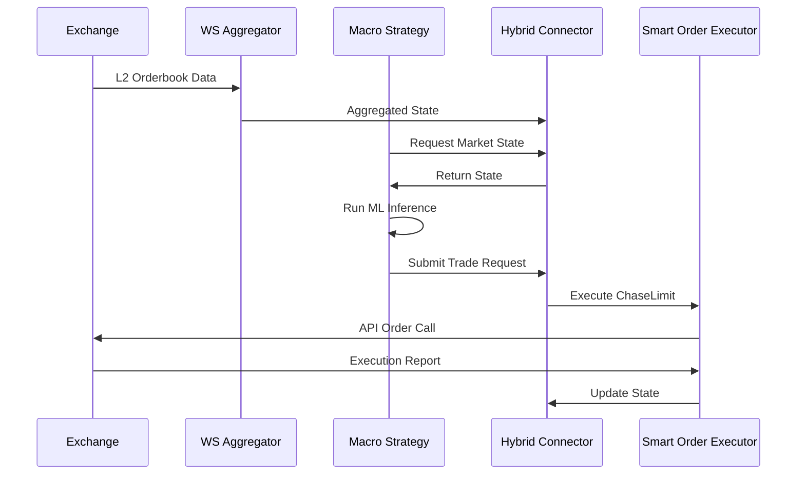

# 🏗️ Stoic Citadel: Deep Architecture Guide

This document provides a technical deep-dive into the internal workings of Stoic Citadel, focusing on the hybrid architecture and core system components.

## 1. Hybrid Decoupling Philosophy

Stoic Citadel is built on the principle of **Decoupled Execution**. We separate the decision-making process (Macro) from the execution logic (Micro) to achieve both intelligence and speed.

### Macro Layer (Intelligence)
*   **Role:** Long-term alpha generation, regime detection, and portfolio optimization.
*   **Components:** Freqtrade Strategy, Meta-Learning Ensemble, HRP Allocator.
*   **Data:** OHLCV (5m, 1h), Feature Store (Redis/Parquet).
*   **Latency:** Seconds (Blocking/Synchronous).

### Micro Layer (Execution)
*   **Role:** Real-time order management, slippage minimization, and safety gating.
*   **Components:** Websocket Aggregator, Smart Order Executor, Circuit Breakers.
*   **Data:** L2 Orderbook, Tickers, Trades.
*   **Latency:** <100ms (Asynchronous/Non-blocking).

---

## 2. The Hybrid Connector

The `src/strategies/hybrid_connector.py` acts as the bridge between the two layers. It provides a thread-safe interface for the Macro Strategy to:
1.  Query real-time market data (spread, liquidity).
2.  Submit execution requests to the Micro Layer.
3.  Receive status updates and execution reports.

---

## 3. Order Execution Engine

Our `SmartOrderExecutor` implements institutional-grade execution algorithms:

### ChaseLimit Logic
Instead of a static limit order, `ChaseLimit` dynamically adjusts the order price based on the best bid/ask and orderbook depth. This ensures high fill rates without paying the spread of a market order.

### TWAP/VWAP Partitioning
Large orders are automatically split into smaller chunks (Child Orders) and executed over time or volume buckets to minimize market impact and detect hidden liquidity.

---

## 4. Risk Core & Safety

Every transaction must pass through the **Risk Gate** (`src/risk/risk_manager.py`):

*   **Circuit Breakers:** Monitors system-wide metrics (drawdown, latency, API health).
*   **Correlation De-risking:** Prevents over-concentration in highly correlated assets using the HRP module.
*   **Position Sizing:** Volatility-adjusted sizing based on the Kelly Criterion or HRP weights.

---

## 5. MLOps & Feature Engineering

The ML pipeline is designed for robustness and low-latency inference:

*   **Feature Store:** Unified access to historical and real-time features.
*   **Meta-Learning:** A secondary model predicts the confidence of primary models, allowing the system to scale down in "unreliable" market regimes.
*   **Time-Series CV:** Advanced cross-validation to prevent data leakage and ensure out-of-sample performance.

---

## 6. Data Flow Diagram

