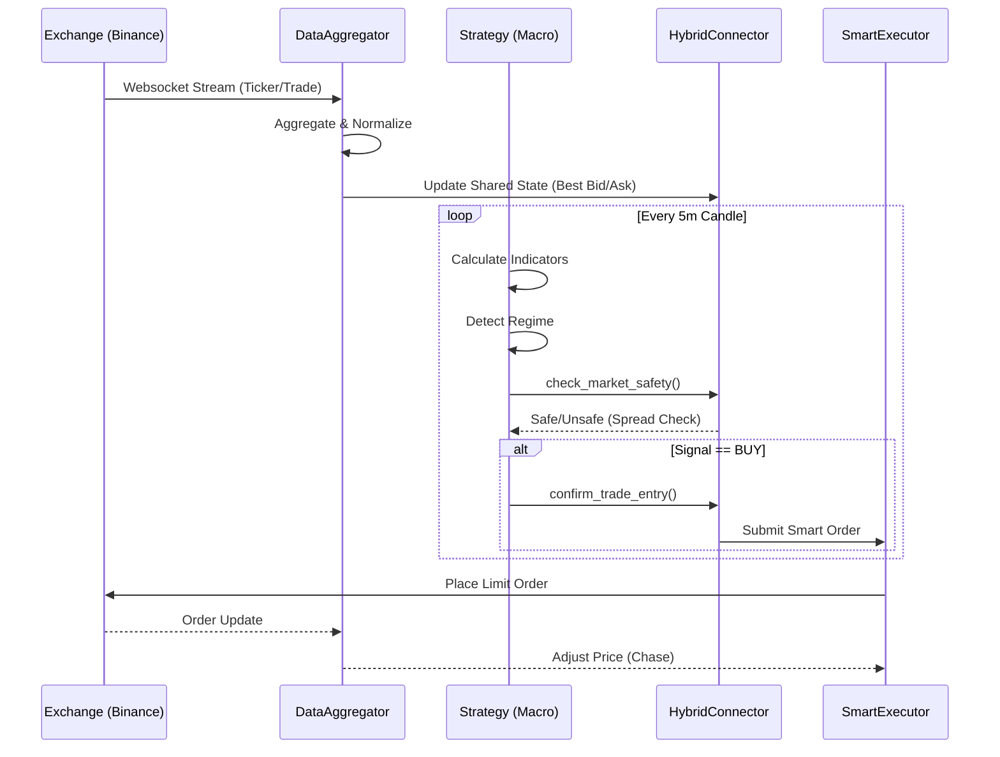

# Hybrid MFT Architecture

## Overview

Stoic Citadel employs a Hybrid Architecture that combines the stability of Freqtrade (Macro Layer) with the speed of custom AsyncIO execution (Micro Layer). This design allows for "Mid-Frequency Trading" (MFT) capabilities, enabling reactions to market changes within milliseconds while maintaining robust strategy logic.

## Layers

### 1. Macro Layer (Strategy)
*   **Technology:** Python, Synchronous, Freqtrade
*   **Responsibility:**
    *   Trend Analysis (EMA, MACD, etc.)
    *   Regime Detection (Hurst, Volatility Z-Score)
    *   Signal Generation (Buy/Sell/Hold)
*   **Update Frequency:** Candle-based (e.g., every 5 minutes)

### 2. Micro Layer (Execution)
*   **Technology:** Python, Asynchronous (`asyncio`)
*   **Responsibility:**
    *   Real-time Orderbook Analysis
    *   Smart Order Execution (`ChaseLimit`, `Pegged`)
    *   Arbitrage Monitoring
*   **Update Frequency:** Tick-based (Real-time Websocket)

## Data Flow

## Key Components

### HybridConnector
The bridge between the synchronous Freqtrade loop and the asynchronous world.
*   Initializes `DataAggregator` and `SmartOrderExecutor` in a background thread.
*   Exposes `get_realtime_metrics()` to the strategy.

### DataAggregator
*   Connects to multiple exchanges via WebSocket.
*   Calculates real-time metrics like Spread %, Orderbook Imbalance, and VWAP.
*   Detects arbitrage opportunities.

### SmartOrderExecutor
*   Manages order lifecycle independently of the strategy loop.
*   **ChaseLimitOrder:** Dynamically updates limit price to stay at the top of the book.
*   **PeggedOrder:** Maintains a fixed distance from Best Bid/Ask.
*   **IcebergOrder:** Splits large orders to minimize market impact.

## Configuration

The system is configured via `src/config/manager.py`, which loads from `config.json` or environment variables.

To enable MFT features:
1.  Set `dry_run: false` (Live Mode).
2.  Ensure API Keys are set in `.env`.
3.  The system automatically initializes the Hybrid layer if running in Live or Dry-Run mode (disabled in Backtest).
