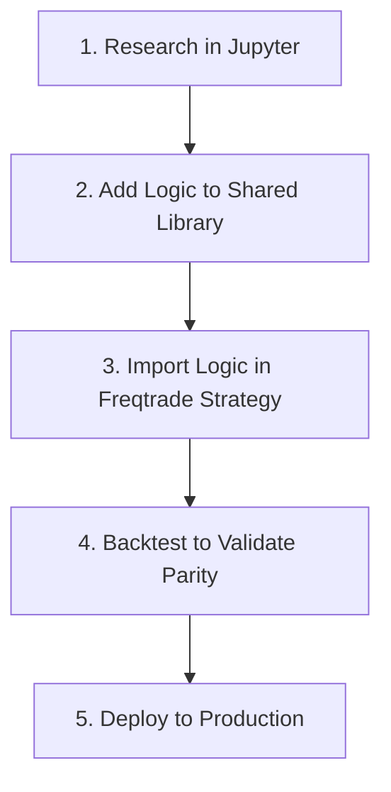

# Strategy Development Guide

This guide covers the end-to-end process of creating, testing, and deploying a new trading strategy within the Stoic Citadel framework.

## 1. Creating a New Strategy

### Step 1: Create the Strategy File

It's recommended to start from the `StrategyTemplate.py`.

```bash
cp user_data/strategies/StrategyTemplate.py user_data/strategies/MyNewStrategy.py
```

Open the new file and change the class name:

```python
# user_data/strategies/MyNewStrategy.py
import talib.abstract as ta
from freqtrade.strategy import IStrategy
from pandas import DataFrame

class MyNewStrategy(IStrategy):
    """
    My New Strategy
    
    Author: Your Name
    Version: 1.0.0
    
    Description:
    - Entry: [Describe entry conditions]
    - Exit: [Describe exit conditions]
    """
    INTERFACE_VERSION = 3

    # Strategy metadata
    minimal_roi = {"0": 0.10}
    stoploss = -0.05
    timeframe = '5m'
```

### Step 2: Implement Your Logic

Fill in the core methods of the strategy.

!!! tip "Use the Core Logic Library"
    For consistency and to prevent code duplication, it's highly recommended to use the shared `StoicLogic` library for indicators and signals.

```python
from src.strategies.core_logic import StoicLogic

# ... inside your strategy class ...

def populate_indicators(self, dataframe: DataFrame, metadata: dict) -> DataFrame:
    """
    Calculate indicators.
    """
    return StoicLogic.populate_indicators(dataframe)

def populate_entry_trend(self, dataframe: DataFrame, metadata: dict) -> DataFrame:
    """
    Define entry conditions.
    """
    dataframe, conditions = StoicLogic.get_entry_signals(dataframe)
    dataframe.loc[conditions, 'enter_long'] = 1
    return dataframe

def populate_exit_trend(self, dataframe: DataFrame, metadata: dict) -> DataFrame:
    """
    Define exit conditions.
    """
    dataframe, conditions = StoicLogic.get_exit_signals(dataframe)
    dataframe.loc[conditions, 'exit_long'] = 1
    return dataframe
```

### Step 3: Test Your Strategy

- **Backtesting:**
  ```bash
  freqtrade backtesting --strategy MyNewStrategy --timerange 20240101-
  ```

- **Hyperparameter Optimization:**
  ```bash
  freqtrade hyperopt --strategy MyNewStrategy --epochs 100 --spaces buy --hyperopt-loss SharpeHyperOptLoss
  ```

---

## 2. Research to Production Pipeline

We follow a strict "Code Once, Use Everywhere" philosophy to ensure that research results are reproducible in a live environment.



1.  **Research:** Develop and test your hypothesis in a Jupyter Notebook using VectorBT.
2.  **Shared Library:** Once validated, move the core logic into pure functions within `src/strategies/core_logic.py`.
3.  **Freqtrade Strategy:** Your strategy should be a thin wrapper that imports and uses the shared logic.
4.  **Parity Test:** Write a unit test to confirm that the output of your research code and production strategy are identical for the same input data.

---

## 3. Best Practices

### Versioning
Always version your strategies in the class name and docstring.

```python
class MyStrategy_v1_2_0(IStrategy):
    """
    Version: 1.2.0
    Changelog:
    - v1.2.0: Added ATR volatility filter.
    - v1.1.0: Changed RSI threshold from 30 to 25.
    - v1.0.0: Initial version.
    """
```

### Use Constants
Avoid "magic numbers" in your code. Define them as constants at the top of your class.

```python
# ❌ Bad
if dataframe['rsi'] < 30:
    ...

# ✅ Good
RSI_OVERSOLD_THRESHOLD = 30
if dataframe['rsi'] < self.RSI_OVERSOLD_THRESHOLD:
    ...
```

### Deployment Checklist

- [ ] Unit tests pass.
- [ ] Backtest is profitable with a Sharpe ratio > 1.0.
- [ ] Max drawdown is within acceptable limits (< 20%).
- [ ] Walk-forward optimization shows robustness.
- [ ] Strategy has run in paper trading for at least one week.
- [ ] Documentation has been updated.
- [ ] Version number has been incremented.
- [ ] A pull request has been submitted and reviewed.
